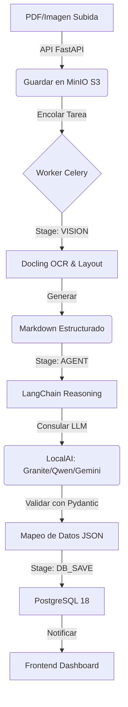

# idp-smart: Intelligent Document Processing - Enterprise Edition 🚀

> **Motor de IA soberano para la extracción semántica y automática de documentos legales, optimizado para PostgreSQL 18, Docling Vision y LLMs de alta precisión.**

---

## 📋 Tabla de Contenidos

1. [Visión del Proyecto](#-visión-del-proyecto)
2. [Ecosistema Tecnológico (El "Por qué")](#-ecosistema-tecnológico-el-por-qué)
3. [Arquitectura de Proceso (Diagramas)](#-arquitectura-de-proceso-diagramas)
4. [¿Por Qué idp-smart es "Smart"?](#-por-qué-idp-smart-es-smart)
5. [Métricas de Rendimiento y Realidad Técnica](#-métricas-de-rendimiento-y-realidad-técnica)
6. [Estructura y Componentes](#-estructura-y-componentes)
7. [Instalación y Uso](#-instalación-y-uso)
8. [Sugerencias para el Futuro (Roadmap Pro)](#-sugerencias-para-el-futuro-roadmap-pro)

---

## 🎯 Visión del Proyecto

**idp-smart** transforma el caos de los documentos físicos en datos JSON puros y validados que alimentan sistemas notariales y registrales sin intervención humana, garantizando **soberanía de datos** al ejecutarse 100% On-Premise o en nubes privadas.

---

## 🧠 Ecosistema Tecnológico (El "Por qué")

*   **FastAPI (Python 3.11)**: El corazón asíncrono que permite manejar cientos de peticiones sin bloquear la UI.
*   **PostgreSQL 18 + UUID v7**: Soporte nativo de UUIDs ordenados cronológicamente para búsquedas instantáneas en millones de registros.
*   **Celery + Valkey (Redis)**: Sistema de colas que garantiza que ninguna extracción se interrumpa por carga del servidor.
*   **Docling Engine**: OCR de última generación que entiende el **layout** (tablas, encabezados y firmas).
*   **LangChain + Pydantic**: El dúo dinámico que garantiza que la IA no invente datos y que el JSON cumpla con esquemas estrictos.

---

## 🏗️ Arquitectura de Proceso (Diagramas)

### 📊 Flujo Lógico de Extracción


---

## 🧠 ¿Por Qué idp-smart es "Smart"? (Y No Requiere Entrenamiento)

A diferencia de soluciones tradicionales de OCR, idp-smart es arquitectónicamente superior por tres razones:

### 1. **Razonamiento en Tiempo Real (Zero-Shot)**
No entrenamos un modelo para cada formulario. Usamos modelos pre-entrenados que "entienden" leyes. Simplemente le pasamos el JSON vacío y la IA usa lógica para extraer el dato. **Funciona con 1, 100 o 1000 formas diferentes al instante sin re-entrenar.**

### 2. **Long-Context Window**
Soportamos contextos de hasta 128,000 tokens. Una escritura de 50 páginas cabe **completa** en la memoria de la IA, lo que evita que se pierda la relación entre el comprador de la página 1 y el vendedor de la página 40.

### 3. **Visión semántica (Docling + VLM)**
No usamos Tesseract (tecnología del año 2000). Usamos **VLM (Vision Language Models)** que entienden dónde están los sellos, las firmas y las tablas como si fueran un abogado humano revisando el expediente.

---

## 📈 Métricas de Rendimiento y Realidad Técnica

Actualmente el sistema soporta dos modos de operación. Los tiempos varían drásticamente según el **Proveedor de IA** elegido:

| Escenario | Google Gemini (Cloud ⚡) | LocalAI (CPU Local 🐢) | LocalAI (GPU Local 🚀) |
|-----------|-------------------------|--------------------------|-------------------------|
| **PDF Texto (5 pág)** | 5-8 segundos | 45-60 segundos | 2-3 segundos |
| **PDF Escaneado (10 pág)** | 10-15 segundos | 1.5 - 2.5 minutos | 5-8 segundos |
| **Doc Repetido (Cache)** | 0.1 segundos | 0.1 segundos | 0.1 segundos |

> [!IMPORTANT]
> **idp-smart** v3.1 está actualmente configurado con `LLM_PROVIDER=google`. Si eliges usar `localai` en CPU, los tiempos serán significativamente mayores (8-10 veces más lentos).

---

## 🔧 Componentes Clave y Puertos

| Servicio | Puerto | Función | Modo |
|----------|--------|---------|------|
| **FastAPI** | 8000 | API REST & Swagger | Workers: 3 |
| **Frontend** | 5173 | Interfaz de Usuario (Vite) | Hot-Reload |
| **LocalAI** | 8080 | Motor LLM (CPU/GPU) | Multimodal |
| **MinIO** | 9000/9001 | S3 Almacenamiento & Consola | Persistente |
| **PostgreSQL** | 5432 | Base de Datos (Native UUID) | v18.3 |
| **Valkey** | 6379 | Broker de Mensajería (Redis) | v7.2 |

---

## 🚀 Instalación y Ejecución

### Arranque Rápido
```bash
# 1. Iniciar servicios
docker compose down && docker compose up -d

# 2. Verificar API
curl http://localhost:8000/api/v1/forms

# 3. Acceder a UI
http://localhost:5173
```

---

## 💡 Sugerencias Estratégicas (Roadmap Pro)

1.  **MinIO Notif**: Disparar Celery vía Redis Streams para reducir latencia inicial de carga de documentos.
2.  **RAG Legal**: Integrar **ChromaDB** para que la IA consulte leyes reales durante la extracción si encuentra ambigüedades.
3.  **Observabilidad**: Panel de **Grafana** para monitorear el consumo de VRAM y el éxito de las extracciones por tipo de acto.

---

**idp-smart v3.1** - *Soberanía Digital y Precisión Notarial asistida por IA.*
