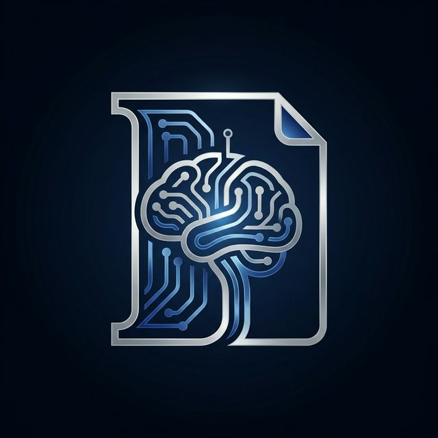
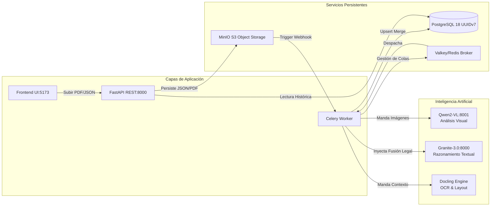
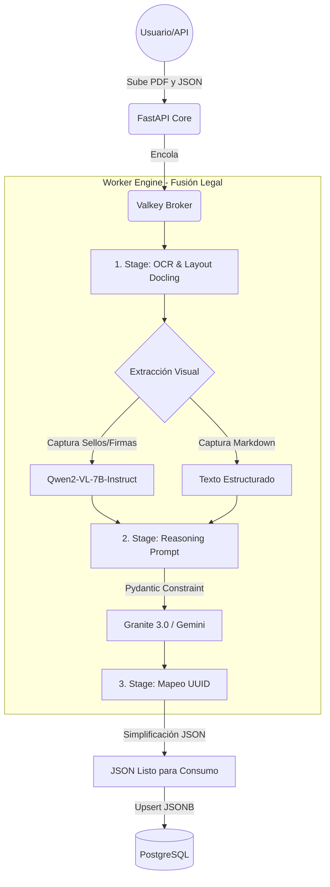
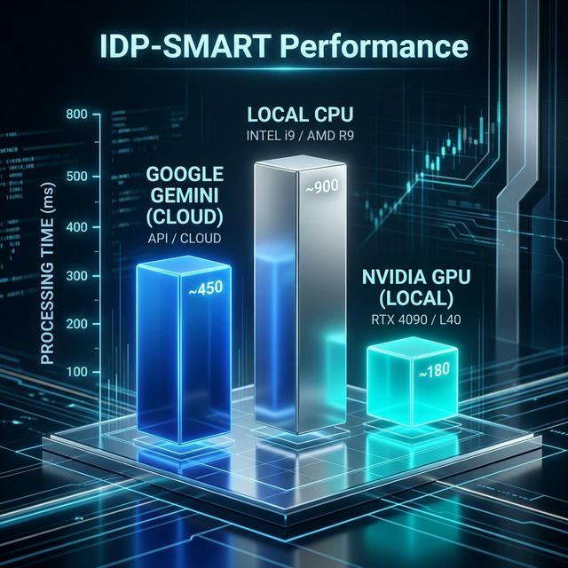

<div align="center">
  
  <h1>idp-smart: Intelligent Document Processing</h1>
  <h3>Enterprise Edition 🚀 v3.2 Multimodal</h3>
</div>

> **Motor de IA soberano para la extracción semántica y automática de documentos legales, optimizado para PostgreSQL 18, procesado Multimodal (Qwen2-VL + Granite 3.0) y soporte dinámico de GPU/CPU.**

---

## 📋 Tabla de Contenidos

1. [Visión del Proyecto](#-visión-del-proyecto)
2. [Arquitectura de Proceso (Diagramas Expandidos)](#-arquitectura-de-proceso-diagramas-expandidos)
3. [Ecosistema Tecnológico (El "Por qué")](#-ecosistema-tecnológico-el-por-qué)
4. [¿Por Qué idp-smart es "Smart"?](#-por-qué-idp-smart-es-smart)
5. [Métricas de Rendimiento y Realidad Técnica](#-métricas-de-rendimiento-y-realidad-técnica)
6. [Estructura y Componentes (Puertos)](#-estructura-y-componentes-puertos)
7. [Instalación y Uso](#-instalación-y-uso)
8. [Estado del Proyecto y Roadmap](#-estado-del-proyecto-y-roadmap)

---

## 🎯 Visión del Proyecto

**idp-smart** transforma el caos de los expedientes físicos (notariales, registrales, jurídicos) en datos JSON puros, estructurados y validados que alimentan sistemas base sin intervención humana. Garantiza **soberanía total de datos** al ejecutarse 100% On-Premise o en Pods Privados, extrayendo información con fiabilidad superior mediante un pipeline multimodal avanzado de **Fusión Legal**.

---

## 🏗️ Arquitectura de Proceso (Diagramas Expandidos)

Para entender cómo se orquesta una extracción masiva de información a través del modelo asíncrono, hemos desplegado sus flujos operativos:

### 1. 🌐 Infraestructura General del Ecosistema


### 2. ⚡ Pipeline Lógico de Inferencia y Mapeo


---

## 🧠 Ecosistema Tecnológico (El "Por qué")

*   **FastAPI (Python 3.11)**: El corazón asíncrono que dirige las peticiones HTTP y levanta el servicio REST, con validaciones extremas para prevenir inyecciones.
*   **PostgreSQL 18 + UUID v7**: Útiles para cronología automática y ordenamiento natural (sortability) de millones de registros (extraordinariamente veloz vs UUIDv4).
*   **MinIO S3 (Webhooks Reactivos)**: Desvincula la carga subida del inicio del proceso. MinIO avisa silenciosamente al Worker cuando el archivo se guardó físicamente.
*   **Celery + Valkey (Redis)**: Sistema inquebrantable de colas. Si el servidor se apaga, Valkey recuerda el documento pendiente.
*   **LangChain + Pydantic**: El dúo dinámico y framework de razonamiento que restringe las alucinaciones. Garantiza que la IA no invente datos y que el JSON de salida cumpla estrictamente con la forma notarial (schema mapping) original.
*   **Pipeline Multimodal Distribuido**: Qwen2-VL detecta visualmente anomalías (sellos desfasados, autógrafas) y Granite 3.0 consolida el razonamiento textual de alto contexto sobre el XML/Markdown.

---

## 🧠 ¿Por Qué idp-smart es "Smart"?

A diferencia de soluciones tradicionales de OCR e indexadores RAG, **idp-smart** fue diseñado como un "abogado sintético":

### 1. **Razonamiento en Tiempo Real (Zero-Shot)**
No entrenamos ni afinamos el modelo para tu formulario específico (ej. "bi34.json"). Alimentamos el esquema al LLM, y la IA decide autónomamente de dónde sacar los datos basándose en puras deducciones legales abstractas. Sube un documento notarial de 1998 o de 2026, lo entenderá.

### 2. **Long-Context Window (No Chunking)**
Soportamos contextos de hasta 128,000 tokens. Los métodos RAG antiguos dividían el documento en pedazos (chunks) perdiendo el contexto legal entre páginas. Nosotros leemos el documento **íntegro**, preservando la jerarquía civil y relacional entre las partes.

### 3. **Fusión Legal (Multimodalidad)**
Los OCR tradicionales (Tesseract, Paddle) y los de nueva guardia de NLP sufren de "Ceguera de Layout" (Ignoran sellos superpuestos y firmas cruzadas). Nuestro Worker primero envía capturas clave al puerto `8001` (Modelo Visual) y manda el texto a Docling. Ambos análisis decantan en el puerto `8000` (Razonamiento) donde la instrucción de "Fusión Legal" resuelve las discrepancias: **Ante conflicto de OCR vs Imagen, la evidencia visual manda.**

### 4. **Procesamiento de Adendas y Updates Acumulativos**
Mediante técnicas de JSONB en PostgreSQL, al subir múltiples PDFs para un solo `parent_task_id`, `idp-smart` hace un _Upsert Semántico_. Si el documento 1 tenía el "Nombre" pero no la "Fecha", y el documento 2 (adenda) tiene la fecha, el JSON final contendrá ambos valores unificados, sin sobre-escritura destructiva.

### 📊 Comparativa Técnica
| Característica | Método Clásico RAG + Chunks | Método idp-smart |
|---|---|---|
| **Preparación** | Meses etiquetando datos ciegos | Cero días. Modelos multi-billonarios |
| **Escalabilidad** | Re-entrenar por cada tipo de forma | Sumar JSON de negocio al catálogo |
| **Contexto** | Se fragmenta (peligro legal) | Documento Íntegro (Zero fragmentación) |
| **Adendas** | Complejo (forzar re-indexación vectorial) | Nativo (suma paramétrica al contexto JSONB) |

---

## 📈 Métricas de Rendimiento y Realidad Técnica

Ajuste de tiempos según la plataforma de hardware y proveedor:

<div align="center">
  
</div>

| Escenario de Extracción | Motor API (Gemini Cloud⚡) | Motor RunPod (VRAM 32GB 🚀) | Modo Fallback CPU Local 🐢 |
|-------------------------|--------------------------|-----------------------------|----------------------------|
| **PDF Texto Puro (5 pág)** | 5-8 segundos             | 8-12 segundos               | 45-60 segundos             |
| **PDF Escaneado Híbrido** | 10-15 segundos           | 15-20 segundos              | 2 - 3 minutos              |
| **Cache Hit (Miss Evt)** | 0.1s                     | 0.1s                        | 0.1s                       |

> [!TIP]
> **idp-smart** gestiona un monitor de VRAM contra colapsos (OOM). Si corres modelos pesados en entornos locales y ocurre una caída de memoria (Out Of Memory), el Worker guarda una referencia preventiva (`_OOM`) en los benchmarks para auditar cuellos de botella mediante `gpu_memory_utilization`.

---

## 🔧 Estructura y Componentes (Puertos)

| Servicio | Puerto Default | Contexto Estructural |
|----------|----------------|----------------------|
| **FastAPI REST API** | `8000` | Gateway Core (Uvicorn Workers) |
| **Frontend UI (Vite)** | `5173` | UI Administrativa |
| **Visión IA (Qwen-VL)** | `8001` *(External)* | Dedicado a *Evidencia Visual* |
| **Razonamiento IA** | `8000` *(External)* | Dedicado a *Inferencia Textual* (Granite) |
| **MinIO S3 Console**| `9001` | Object Storage Bucket Administration |
| **PostgreSQL 18** | `5432` | Persistencia Relacional y JSONB |
| **Valkey (Redis Base)**| `6379` | Message Broker & OCR Caching |

> **Nota:** Todos los recursos remotos y locales deben parametrizarse en el `.env` para garantizar la soberanía, aislando IPs e integrando protección perimetral.

---

## 🚀 Instalación y Uso

**1. Clonación e inicialización del entorno:**
Clona el repositorio e infla los contenedores. La BBDD y MinIO se inicializan solos con sus respectivos buckets y webhooks.
```bash
docker compose pull
docker compose up --build -d
```

**2. Monitorear Logs del Trabajador Silencioso:**
Para ver cómo se efectúa la _Fusión Legal_:
```bash
docker logs idp_worker -f
```

---

## 🚦 Estado del Proyecto y Roadmap

| Milestone | Status | Detalles Técnicos |
|-----------|--------|-------------------|
| **Pipeline NLP-Visión Integrado** | ✅ Prod | OCR Docling + Qwen2-VL Visión en tándem |
| **Reactive MinIO Webhooks** | ✅ Prod | Ingesta auto-accionada por capa de red |
| **Native UUID v7 / OOM Catcher** | ✅ Prod | Bases resueltas para altísima concurrencia |
| **RAG (Legal Intelligence)** | ⏳ Dev | Búsqueda semántica (Chromadb/Qdrant) contra jurisprudencia local |
| **Telemetry & Observability** | ⏳ Pln | Monitor de salud Prometheus/Grafana |

---

## 📖 Referencias de Arquitectura Adicionales
- **[Ajuste de Hardware AI](MIGRATION_GUIDE.md)**: Cómo configurar instancias NVIDIA vLLM de 32 a 80 GB.
- **[Esquemas JSON Activos](docs/DOCLING_QUICK_START.md)**: Reglas de minificación sobre Catálogos Registrales.

---

**idp-smart v3.2** - *Soberanía Digital y Precisión Extrema asistida por Motores Híbridos IA.*
