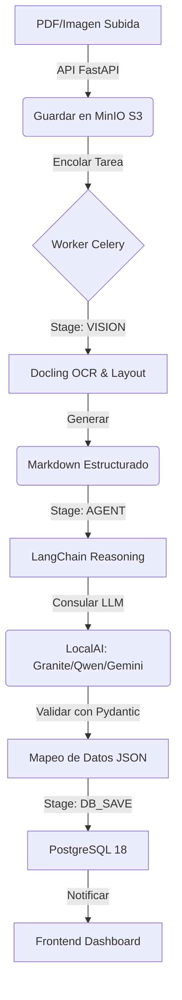

<div align="center">
  
  <h1>idp-smart: Intelligent Document Processing</h1>
  <h3>Enterprise Edition 🚀</h3>
</div>

> **Motor de IA soberano para la extracción semántica y automática de documentos legales, optimizado para PostgreSQL 18, Docling Vision y LLMs de alta precisión.**

---

## 📋 Tabla de Contenidos

1. [Visión del Proyecto](#-visión-del-proyecto)
2. [Ecosistema Tecnológico (El "Por qué")](#-ecosistema-tecnológico-el-por-qué)
3. [Arquitectura de Proceso (Diagramas)](#-arquitectura-de-proceso-diagramas)
4. [¿Por Qué idp-smart es "Smart"?](#-por-qué-idp-smart-es-smart)
5. [Métricas de Rendimiento y Realidad Técnica](#-métricas-de-rendimiento-y-realidad-técnica)
6. [Estructura y Componentes](#-estructura-y-componentes)
7. [Instalación y Uso](#-instalación-y-uso)
8. [Estado del Proyecto y Roadmap](#-estado-del-proyecto-y-roadmap)
9. [Escalabilidad Futura](#-escalabilidad-futura)

---

## 🎯 Visión del Proyecto

**idp-smart** transforma el caos de los documentos físicos en datos JSON puros y validados que alimentan sistemas notariales y registrales sin intervención humana, garantizando **soberanía de datos** al ejecutarse 100% On-Premise o en nubes privadas.

---

## 🧠 Ecosistema Tecnológico (El "Por qué")

*   **FastAPI (Python 3.11)**: El corazón asíncrono que permite manejar cientos de peticiones sin bloquear la UI.
*   **PostgreSQL 18 + UUID v7**: Soporte nativo de UUIDs ordenados cronológicamente para búsquedas instantáneas en millones de registros.
*   **Celery + Valkey (Redis)**: Sistema de colas que garantiza que ninguna extracción se interrumpa por carga del servidor.
*   **Docling Engine**: OCR de última generación que entiende el **layout** (tablas, encabezados y firmas).
*   **LangChain + Pydantic**: El dúo dinámico que garantiza que la IA no invente datos y que el JSON cumpla con esquemas estrictos.

---

## 🏗️ Arquitectura de Proceso (Diagramas)

### 📊 Flujo Lógico de Extracción


---

## 🧠 ¿Por Qué idp-smart es "Smart"? (Y No Requiere Entrenamiento)

A diferencia de soluciones tradicionales de OCR, idp-smart es arquitectónicamente superior por tres razones:

### 1. **Razonamiento en Tiempo Real (Zero-Shot)**
No entrenamos un modelo para cada formulario. Usamos modelos pre-entrenados que "entienden" leyes. Simplemente le pasamos el JSON vacío y la IA usa lógica para extraer el dato. **Funciona con 1, 100 o 1000 formas diferentes al instante sin re-entrenar.**

### 2. **Long-Context Window (No Chunking)**
Soportamos contextos de hasta 128,000 tokens. Los métodos antiguos dividían el documento en pedazos (chunks) perdiendo el contexto legal. Nosotros leemos el documento **íntegro**, preservando la jerarquía legal completa entre páginas.

### 3. **Visión semántica (VLM vs OCR Tradicional)**
*   **Tesseract (2000):** Falla en sellos superpuestos y requiere limpieza manual.
*   **PaddleOCR:** Bueno para IDs, pero no entiende relaciones legales.
*   **Docling + Granite-Vision:** Entiende tablas, firmas y contexto semántico. Es como un abogado humano revisando el expediente.

### 📊 Comparativa Técnica
| Característica | Método RAG + Chunks | Método idp-smart |
|---|---|---|
| **Preparación** | Meses etiquetando datos | Cero días. Modelo pre-entrenado |
| **Escalabilidad** | Re-entrenar por cada forma | Sumar JSON a catálogo |
| **Contexto** | Se fragmenta | Íntegro (Zero fragmentación) |
| **Adendas** | Complejo (re-indexar) | Nativo (suma al contexto) |

---

## 📈 Métricas de Rendimiento y Realidad Técnica

Ajuste de tiempos según el **Proveedor de IA**:

| Escenario | Google Gemini (Cloud ⚡) | LocalAI (CPU Local 🐢) | LocalAI (GPU Local 🚀) |
|-----------|-------------------------|--------------------------|-------------------------|
| **PDF Texto (5 pág)** | 5-8 segundos | 45-60 segundos | 2-3 segundos |
| **PDF Escaneado (10 pág)** | 10-15 segundos | 1.5 - 2.5 minutos | 5-8 segundos |
| **Doc Repetido (Cache)** | 0.1 segundos | 0.1 segundos | 0.1 segundos |

> [!IMPORTANT]
> **idp-smart** v3.2 está configurado con `LLM_PROVIDER=google`. El modo local en CPU es 8-10 veces más lento.

---

## 🔧 Componentes Clave y Puertos

| Servicio | Puerto | Función | Modo |
|----------|--------|---------|------|
| **FastAPI** | 8000 | API REST & Swagger | Workers: 3 |
| **Frontend** | 5173 | Interfaz de Usuario (Vite) | Hot-Reload |
| **LocalAI** | 8080 | Motor LLM (CPU/GPU) | Multimodal |
| **MinIO** | 9000/9001 | S3 Almacenamiento & Consola | Persistente |
| **PostgreSQL** | 5432 | Base de Datos (Native UUID) | v18.3 |
| **Valkey** | 6379 | Broker de Mensajería (Redis) | v7.2 |

---

## 🚀 Instalación y Ejecución

### Arranque Rápido
```bash
docker compose down && docker compose up -d
```

---

## 🚦 Estado del Proyecto

| Componente | Status | Detalles |
|-----------|--------|----------|
| **Docling Integration** | ✅ Estable | OCR y layout semántico |
| **Reactive Ingestion** | ✅ Estable | Webhook MinIO -> API -> Celery |
| **Native UUID v7** | ✅ Estable | PostgreSQL 18.x |
| **Visual Audit** | ✅ Estable | Visión PDF/Markdown en UI |
| **Forms Catalog** | ✅ Estable | 100+ esquemas dinámicos |

---

## 📈 Escalabilidad Futura (Roadmap)

1.  **✅ MinIO Reactive Trigger**: Implementado en v3.2.
2.  **⏳ RAG Legal**: Integración con **ChromaDB/Qdrant** para consulta de leyes.
3.  **⏳ vLLM Migration**: Sustituir LocalAI por vLLM para throughput masivo (PagedAttention) cuando se superen los 50 expedientes simultáneos.
4.  **⏳ Observabilidad**: Dashboards de **Grafana + Prometheus**.

---

## 📖 Referencias Técnicas
- **[docs/DOCLING_QUICK_START.md](docs/DOCLING_QUICK_START.md)** - Guía de visión.
- **[docs/CHANGELOG.md](docs/CHANGELOG.md)** - Historial de versiones.
- **[MIGRATION_GUIDE.md](MIGRATION_GUIDE.md)** - Guía para despliegue On-Premise.

---

**idp-smart v3.2** - *Soberanía Digital y Precisión Notarial asistida por IA.*
