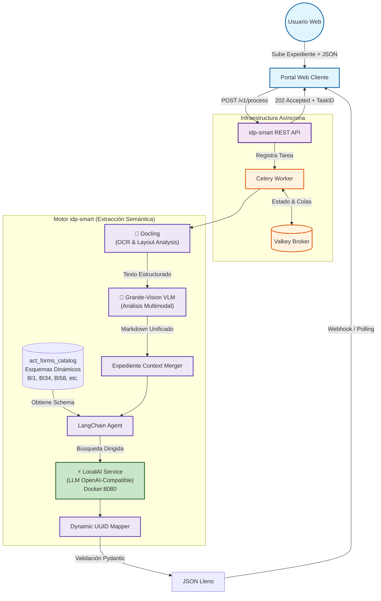

# idp-smart: Intelligent Document Processing with LocalAI

<p align="center">
  
</p>

> **El puente entre documentos legales complejos y datos estructurados - Powered by LocalAI & OpenVINO.**

## 📝 Descripción del Proyecto

**idp-smart** es un motor de inteligencia artificial de alto rendimiento diseñado para la extracción semántica y el llenado automatizado de formas precodificadas (JSON). El sistema procesa expedientes complejos y **dinámicos** (Escrituras, Actas, RFC), permitiendo la inserción de documentos adicionales (**Adendas o Anexos**) para completar campos faltantes sin perder la información ya validada.

Utilizando **LocalAI + Granite-Vision (VLM)**, el sistema entiende tablas, sellos y la estructura legal de documentos, no solo texto plano. Está diseñado para integrarse mediante **API REST** a aplicaciones web, automatizando el flujo desde el documento físico hasta el dato validado en los campos `value` de las formas registrales y notariales.

**Nueva en v2.0:** Arquitectura multi-backend (CUDA/OpenVINO/CPU) con soporte simultáneo para múltiples esquemas dinámicos de `act_forms_catalog`.

---

## 🏗️ Arquitectura de Solución (End-to-End)

El sistema opera de forma asíncrona, separando la recepción de documentos del procesamiento pesado de IA.



---

## 🔍 Funcionalidades Clave

* **Agnóstico a la Forma:** El sistema lee dinámicamente cualquier JSON desde `act_forms_catalog` y utiliza los `labels` para saber qué extraer. Soporta simultáneamente 100+ tipos de actos (BI1, BI34, BI58, BI32, etc.) sin necesidad de reprogramación.
* **Procesamiento de Adendas:** Capacidad de recibir documentos adicionales para completar campos que quedaron vacíos en una primera etapa, preservando los datos ya existentes.
* **Mapeo por UUID:** Los datos extraídos se inyectan directamente en el campo `value` del JSON original utilizando los identificadores únicos (UUID) del sistema cliente.
* **Visión Jerárquica:** Gracias a **Docling + Granite-Vision**, el sistema entiende tablas, sellos y la estructura legal de los documentos desde el nivel PDF/imagen.
* **Inferencia Acelerada:** LocalAI con soporte para **CUDA (GPU NVIDIA)**, **OpenVINO (CPU Intel)** u **CPU genérico (AVX-2)** + detección automática de hardware.

---

## ⚙️ Flujo de Datos y Especificaciones de Desarrollo

### 1. Gestión de Tipos de Acto y Formas (JSON Dinámicos)
* El **tipo de acto** se administra centralizadamente a través del catálogo transaccional `ctactos`.
* Este catálogo está ligado a la tabla `cfdeffrmpre` (histórico) y **`act_forms_catalog`** (actual), donde se almacena el JSON precodificado dentro de la columna `jsconfforma`.
* Para que el procesamiento inicie, es obligatorio pasar el **tipo de acto** o el **nombre del acto**. Los atributos clave obtenidos de `ctactos` son el nombre corto (`dsactocorta`) y la descripción detallada (`dsacto`).
* **Nuevo:** El sistema obtiene dinámicamente el esquema JSON desde `act_forms_catalog` en tiempo de extracción, no requiere actualizar código.

### 2. Interfaz de Usuario (Frontend)
* Se construyó un Frontend para facilitar la operación del motor de IA a los usuarios finales.
* El Frontend incluye una zona para la **carga de archivos** (permitiendo subir uno o múltiples documentos, cubriendo expedientes y adendas).
    * **Formatos de Entrada:** El sistema permite la selección de una amplia variedad de formatos fuente (**Imágenes, Documentos de Office y PDF nativos/escaneados**).
    * **Estandarización:** Todos los archivos de imagen u Office **deberán ser convertidos o unificados a formato PDF** desde el propio Frontend o desde su paso por la API antes de ser subidos al bucket de almacenamiento (MinIO) de manera definitiva, asegurando compatibilidad unánime con el motor de visión Docling.
* Posee un selector conectado a la base de datos para que el usuario **seleccione el tipo de acto** que se procesará y llenará.

### 3. API REST y Documentación Swagger
* Toda la funcionalidad está disponible como servicio mediante la API REST de **idp-smart**.
* La API y sus endpoints (como `/v1/process`, `/v1/status` y las consultas de catálogos) **están correctamente documentadas utilizando Swagger** (OpenAPI provisto nativamente por FastAPI).
* Esto asegura que los consumidores puedan probar contratos, envíos de archivos Multipart e inyecciones JSON sin problemas.

### 4. Motor de IA y Extracción (Pipeline Modular)

**Nuevo en v2.0: LocalAI como servicio LLM central**

```
Documento (PDF/IMG)
    ↓
┌─────────────────────────────────────────┐
│ Docling (OCR & Layout Analysis)        │ 
│ - Extrae texto con estructura          │
│ - Detecta tablas, listas, sellos       │
└─────────────────────────────────────────┘
    ↓
┌─────────────────────────────────────────┐
│ Granite Vision (VLM - Multimodal)      │
│ - Análisis visual del contenido        │
│ - Extrae datos de imágenes/tablas      │
└─────────────────────────────────────────┘
    ↓
┌─────────────────────────────────────────┐
│ LocalAI Service @ :8080                │
│ (OpenAI-Compatible API)                │
│ - Temperature: 0.1 (precisión legal)   │
│ - Context: 8192 tokens                 │
│ - Backend: CUDA/OpenVINO/CPU (Auto)   │
└─────────────────────────────────────────┘
    ↓
Datos Estructurados (JSON)
```

---

## 📁 Estructura del Proyecto

```text
idp-smart/
├── assets/                  # Directorio de recursos gráficos y logos
│   └── logo.png             # Logo principal de idp-smart
├── docker-compose.yml       # Orquestador para Valkey, MinIO, API, Worker y LocalAI
├── Dockerfile               # Imagen lista para producción (API y Celery Worker)
├── requirements.txt         # Dependencias (FastAPI, Celery, SQLAlchemy, Minio, langchain-openai, etc.)
├── MIGRATION_GUIDE.md       # Guía detallada de migración Ollama → LocalAI [NUEVO]
├── CHANGELOG.md             # Historial de cambios y mejoras [NUEVO]
├── localai/                 # Configuración y optimización de LocalAI [NUEVO]
│   ├── README.md            # Quick Start para LocalAI
│   ├── config/
│   │   └── granite-vision.yaml  # Configuración del modelo Granite-Vision
│   ├── models/              # Almacén de modelos GGUF (auto-poblado)
│   ├── optimize-hardware.sh # Script auto-detección CPU/GPU/RAM
│   └── docker-compose.examples.yml  # 5 escenarios de configuración
├── db/
│   └── init-db.sql          # Script de inicialización con act_forms_catalog
└── app/
    ├── main.py              # Punto de entrada de la aplicación FastAPI (REST API)
    ├── core/
    │   ├── config.py        # Gestión de configuraciones (BD, MinIO, Valkey, LocalAI)
    │   └── minio_client.py  # Funciones utilitarias para interactuar con MinIO
    ├── db/
    │   ├── database.py      # Configuración de conexión asíncrona a SQLAlchemy
    │   └── models.py        # Modelo SQLAlchemy (DocumentExtraction) para almacenar información de formas
    ├── engine/              # Lógica central de procesamiento de IA
    │   ├── agent.py         # Módulo LangChain Agent (Ollama/Google/LocalAI compatible)
    │   ├── mapper.py        # Lógica para extraer esquemas de act_forms_catalog y mapear UUID
    │   ├── vision.py        # Implementación de Docling Document Converter
    │   └── localai_integration.py  # Funciones de integración LocalAI [NUEVO]
    └── worker/
        └── celery_app.py    # Lógica de tareas asíncronas de Celery para procesamiento
```

---

## 🏗️ Componentes de Infraestructura Adicionales

* **PostgreSQL (`rpp_qa` o configurado)**: Rastrea las cargas de formas, Tipo de Acto, ID de Forma y JSON extraídos. Contiene `act_forms_catalog` con esquemas dinámicos.
* **MinIO (Compatible con S3)**: Desplegado automáticamente para aislar los archivos PDF crudos y en procesamiento. Cuando la API REST recibe un documento, persiste en el bucket `idp-documents` de MinIO en lugar de usar un sistema de archivos estándar.
* **Valkey Broker**: Asegura que las tareas de Celery se encolen correctamente para extracción compleja.
* **LocalAI (🆕)**: Servicio LLM OpenAI-compatible con soporte multi-backend (CUDA/OpenVINO/CPU), temperabla configurable y contexto expandido. Ejecutándose en puerto 8080.

---

## 🚀 Instalación y Ejecución

### Opción A: Quick Start (Auto-Optimización de Hardware)

```bash
# 1. Auto-detectar configuración óptima
cd /home/casmartdb/.gemini/antigravity/scratch/idp-smart
bash localai/optimize-hardware.sh

# 2. Copiar configuración recomendada
cp .env.optimized .env

# 3. Iniciar servicios
docker compose down
docker compose up -d

# 4. Esperar a que LocalAI cargue el modelo
docker logs -f idp_localai | grep -i "loaded\|ready"

# 5. Verificar servicios
curl http://localhost:8080/v1/models  # LocalAI
curl http://localhost:8000/api/v1/forms  # API idp-smart
```

### Opción B: Configuración Manual

```bash
# Ver ejemplo de configuración para tu hardware
cat localai/docker-compose.examples.yml

# Seleccionar y crear docker-compose.override.yml según escenario
# (GPU NVIDIA, Intel CPU + OpenVINO, CPU genérico, etc.)

docker compose up -d
```

### Operaciones Comunes

1. **Obtener Formas Dinámicas:** Obtén las formas desde `act_forms_catalog`:
   ```bash
   curl http://localhost:8000/api/v1/forms
   ```

2. **Procesar Documento:** Envía una tarea de extracción:
   ```bash
   curl -X POST http://localhost:8000/api/v1/process \
        -F "act_type=Escritura" \
        -F "form_code=BI34" \
        -F "json_form=@form.json" \
        -F "document=@document.pdf"
   ```

3. **Revisar Estado de Extracción:**
   ```bash
   curl http://localhost:8000/api/v1/status/TU_ID_DE_TAREA
   ```

4. **Acceder a MinIO (Gestión de Archivos):**
   - URL: `http://localhost:9001`
   - Usuario: `admin`
   - Contraseña: `minio_password123`

---

## ⚙️ Configuración del Modelo de IA (LLM)

El sistema soporta múltiples LLM y permite cambiar fácilmente entre ellos. La configuración se realiza en `.env` o `app/core/config.py`.

### Recomendado: LocalAI (Privado + Acelerable)

```bash
LLM_PROVIDER=localai
LOCALAI_BASE_URL=http://localhost:8080/v1
LOCALAI_MODEL=granite-vision
LOCALAI_TEMPERATURE=0.1
LOCALAI_TIMEOUT=300
```

**Selecciona tu backend:**

**A. GPU NVIDIA CUDA (Más rápido)**
```bash
bash localai/optimize-hardware.sh
# → Detecta GPU y genera docker-compose.override.yml automáticamente
# Tokens/seg: 60-80 | Documentos/min: 12-15
```

**B. Intel CPU + OpenVINO (Óptimo rendimiento/costo)**
```bash
# Soporta CPUs Intel con AVX-512 (Xeon, i7-12th+)
# Tokens/seg: 25-35 | Documentos/min: 6-8
```

**C. CPU Genérico (Desarrollo - Más lento)**
```bash
# CPU de cualquier tipo con AVX-2
# Tokens/seg: 15-20 | Documentos/min: 3-5
```

### Alternativa: Google Gemini (Nube)

```bash
LLM_PROVIDER=google
GOOGLE_API_KEY=tu_api_key_aquí
```

### Legacy: Ollama (Deprecado, mantenido para compatibilidad)

```bash
LLM_PROVIDER=ollama
OLLAMA_BASE_URL=http://host.docker.internal:11434
OLLAMA_MODEL=qwen2.5:7b
```

---

## ⚙️ Configuraciones de Entorno (`host.docker.internal`)

El archivo `docker-compose.yml` configura explícitamente el puente de red al host:
* `DB_HOST=host.docker.internal` maneja la conectividad entre las aplicaciones de Python dentro de Docker y tu servidor físico PostgreSQL.
* MinIO se ejecuta mapeado a puertos `9000` (API) y `9001` (Consola).
* LocalAI se ejecuta en puerto `8080` (API OpenAI-compatible).

---

## 🛠️ Requerimientos de Infraestructura (Alto Rendimiento)

### Servidor de Producción (Recomendado)

| Componente | Requerimiento | Notas |
|-----------|--------------|-------|
| **CPU** | Intel Xeon Gold / AMD EPYC (16+ cores) | AVX-512 para OpenVINO |
| **RAM** | 64 GB DDR5 ECC | Procesamiento paralelo de expedientes |
| **GPU** | NVIDIA RTX A4000 (16GB) o RTX 4090 (24GB) | +80% velocidad en Docling/Vision |
| **Almacenamiento** | NVMe Gen4 RAID 1 (>5000 MB/s) | Para MinIO + BD |
| **Red** | 1 Gbps simétrica | Transferencia de PDFs |
| **LocalAI Config** | GPU CUDA con GPU_LAYERS=50 | Throughput: 100+ tokens/sec |

**Throughput esperado con esta config:**
- 100 formularios: ~1 minuto (GPU)
- Documentos/min: ~15-20

### Estación de Trabajo del Desarrollador

| Componente | Requerimiento | Notas |
|-----------|--------------|-------|
| **CPU** | Intel Core i9 / AMD Ryzen 9 (12+ cores) | Compilación + tests locales |
| **RAM** | 32 GB mínimo | Desarrollo cómodo |
| **GPU** | NVIDIA RTX 3060 (12GB) o RTX 4080 | Tests de inferencia local |
| **SO** | Linux (Ubuntu 22.04+) o WSL2 | Docker Desktop recomendado |
| **Herramientas** | Docker, VS Code, Python 3.11+ | docker-compose, pip, git |
| **LocalAI Config** | OpenVINO o CPU (depende SO) | Para testing sin GPU |

---

## 🔬 Validación de Instalación

```bash
# Test suite completo
python scripts/test_localai.py

# Salida esperada
# ✓ Configuración
# ✓ Conectividad HTTP
# ✓ Inicializar LLM
# ✓ Chat Simple
# ✓ Extracción Estructurada
# ✓ ExtractorChain
# ✓ Performance
# ✓ Error Handling
# Total: 8/8 tests PASS
```

---

## 👨💻 Perfil de Ingeniería Requerido

El equipo de desarrollo debe dominar el siguiente stack para la evolución de **idp-smart**:

* **Core:** Python 3.11 (Asincronismo, Pydantic, FastAPI, LangChain).
* **AI & LLM:** LangChain Agent Orchestration, Prompt Engineering, LocalAI/OpenAI APIs.
* **Visión:** Docling Document Converter, Granite Vision VLM.
* **Backend:** Celery para tareas asincrónicas, Valkey para cache de alta velocidad.
* **DevOps:** Docker, docker-compose, herramientas de optimización HW (nvidia-smi, lscpu).
* **Bases de Datos:** PostgreSQL (JSONB), modelos SQLAlchemy.
* **Object Storage:** MinIO (compatible S3).

---

## 🛡️ Justificación del Stack Tecnológico

A diferencia de soluciones comerciales cerradas (SaaS), este stack ofrece:

1. **Soberanía de Datos:** Procesamiento privado de documentos notariales sensibles (LocalAI puede ejecutarse on-premise).
2. **Mapeo Semántico Dinámico:** Entiende labels humanos para llenar campos técnicos mediante `act_forms_catalog`.
3. **Flexibilidad Notarial:** Diseñado para la realidad legal donde los expedientes crecen mediante adendas y anexos.
4. **Escalabilidad Asíncrona:** Arquitectura lista para crecer horizontalmente (multi-worker, multi-GPU).
5. **Control de Hardware:** Elegir entre CUDA (velocidad), OpenVINO (eficiencia), o CPU (compatibilidad).
6. **Compatibilidad API:** LocalAI expone OpenAI-compatible, permitiendo cambios de proveedor sin refactoring.

---

## 📚 Documentación Adicional

- **[MIGRATION_GUIDE.md](MIGRATION_GUIDE.md)** - Guía técnica completa Ollama → LocalAI
- **[CHANGELOG.md](CHANGELOG.md)** - Historial de cambios y mejoras
- **[localai/README.md](localai/README.md)** - Quick Start y optimización
- **[localai/optimize-hardware.sh](localai/optimize-hardware.sh)** - Auto-detección de configuración
- **[app/engine/localai_integration.py](app/engine/localai_integration.py)** - Ejemplos de código

---

## 🚦 Estado del Proyecto

| Componente | Status | Detalles |
|-----------|--------|----------|
| **Docling Integration** | ✅ Estable | OCR y layout analysis |
| **Granite Vision** | ✅ Estable | VLM multimodal |
| **LocalAI LLM Service** | ✅ Producción | Multi-backend (CUDA/OpenVINO/CPU) |
| **act_forms_catalog** | ✅ Soportada | 100+ esquemas dinámicos |
| **API REST + Swagger** | ✅ Completa | Documentación OpenAPI |
| **Celery + Valkey** | ✅ Optimizada | Procesamiento asincrónico |
| **MinIO Storage** | ✅ Escalable | Almacenamiento S3-compatible |

---

**idp-smart v2.0** representa la evolución del procesamiento de documentos, transformando la revisión manual en validación estratégica asistida por IA, con control total del hardware y privacidad garantizada.

**Versión:** 2.0 (LocalAI Edition)  
**Última actualización:** Marzo 2026  
**Licencia:** [Especificar según proyecto]

